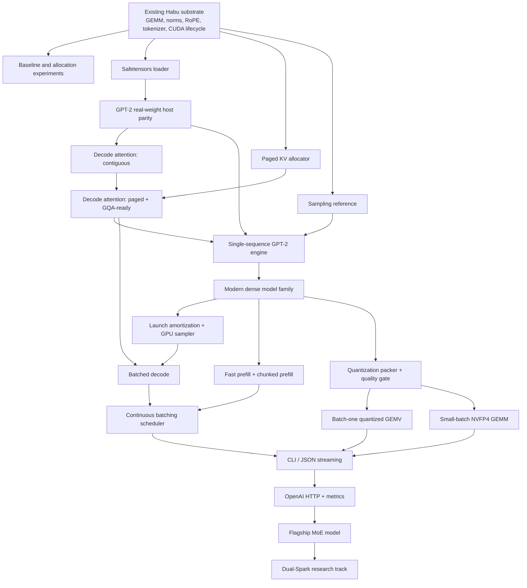

# Habu GB10-Native Inference Engine Plan

**Working name:** HabuRT / Habu Spark Runtime  
**Target platform:** NVIDIA GB10 / DGX Spark-class systems  
**Document date:** 2026-07-21  
**Status:** Revised implementation plan based on the current Habu GB10 UMA epic, repository state, NVIDIA CUDA/DGX documentation, and vLLM architecture

---

## 1. Executive decision

Build a **GB10-native, inference-only serving engine in Habu**, but do not describe it as a port or rewrite of vLLM.

The product should be:

> A small, ahead-of-time-specialized inference engine for one GB10, one loaded model, and low-to-moderate concurrency, with safe unified-memory planning, fast model-specific kernels, quantized execution, and one-command serving.

The initial engine should deliberately omit broad compatibility:

- One GB10.
- One model loaded at a time.
- One modern decoder-only model family after a GPT-2 integration milestone.
- Batch one through a small bounded batch.
- BF16/FP16 first, then one optimized low-bit path.
- Local CLI/streaming first, OpenAI-compatible HTTP later.
- No training or autograd.
- No multi-node execution in the first product.
- No arbitrary Hugging Face architecture support.
- No multimodal models, beam search, speculative decoding, LoRA, or multi-tenant isolation in the first release.

Under those constraints, this is a medium-sized systems campaign. A general engine matching vLLM's breadth would still be a large, continuing project.

---

## 2. Corrected technical thesis

The strongest version of the thesis is not:

> UMA deletes most of what makes vLLM hard.

It is:

> GB10 UMA lets Habu remove the discrete-memory offload tier, use one capacity planner, avoid full-weight staging copies, and specialize the remaining serving machinery for one architecture and a small concurrency envelope.

This distinction matters.

### UMA genuinely simplifies

GB10 supplies a coherent 128 GB CPU/GPU memory pool with approximately 273 GB/s of memory bandwidth. Full CUDA unified-memory systems can expose ordinary process-owned memory, including file-backed `mmap` regions, to GPU code. This permits a loader and runtime design that is impossible or unattractive on a conventional discrete GPU:

- One global capacity plan for OS, weights, KV cache, workspaces, metadata, and services.
- No mandatory CPU-to-GPU copy of the entire checkpoint.
- No separate host KV-cache swap tier in the first engine.
- File-backed, packed model images that can be mapped into the process.
- CPU and GPU cooperation over coherent structures where measurements justify it.
- Early refusal of unsafe configurations before the machine enters memory pressure.

### UMA does not eliminate

Paged KV management remains valuable because sequence lengths are dynamic, KV allocations grow token by token, requests finish at different times, prefix blocks can be shared, and contiguous per-request reservations fragment memory. Those problems exist within one physical memory pool.

Continuous batching also remains a real scheduler:

- Requests arrive and finish at different times.
- Prefill and decode have different compute profiles.
- Long prefills can block interactive decode unless prefills are chunked.
- Admission must account for possible KV growth.
- Cancellation, fairness, backpressure, and request deadlines remain.
- A full KV cache may still require waiting, rejection, or recomputation-based preemption.

Current vLLM V1 has already removed its legacy CPU swap-space mechanism. Therefore Habu's differentiation cannot be "vLLM still spends most of its complexity swapping KV blocks between CPU and GPU." The differentiation is a much narrower execution contract, GB10-specific memory policy, model-specific compilation, and fewer compatibility layers.

---

## 3. Assessment of the current Habu epic

The repository's current epic is well structured and already contains the correct skeleton:

- Native safetensors parsing and an explicit direct-`mmap` versus allocated-buffer residency experiment.
- A fixed-page KV allocator with block tables, refcounts, prefix sharing, and copy-on-append.
- A contiguous-then-paged decode-attention kernel sequence.
- Exact GPT-2 real-weight parity as the first vertical integration target.
- A single-sequence prompt-to-token engine before continuous batching.
- NVFP4 after a BF16 baseline.
- Serving after engine correctness and scheduling.
- Fail-closed validation and named error paths throughout.

The revised plan retains that structure but corrects several assumptions and adds missing production gates.

### Corrections required

#### 3.1 Direct file mapping is an option, not the predetermined weight policy

A GPU on a full unified-memory system can address file-backed mappings. That establishes correctness, not performance.

The runtime must measure at least:

1. Direct reads from a prefaulted file-backed mapping.
2. Reads from system memory registered or advised for GPU access.
3. Reads from a CUDA allocation populated once from the file.
4. Packed versus original safetensors layout.
5. Cold-start page-fault behavior versus steady-state decode.

The chosen policy may differ by model size and weight layout. Direct mapping may win by avoiding duplication; a CUDA allocation or packed image may win through page placement, alignment, page size, and predictable residency.

#### 3.2 The scheduler does not collapse to one watermark

A single allocator watermark is a useful admission signal, but it is not a sufficient scheduler.

The first scheduler may remain small, but it still needs:

- Waiting, prefilling, decoding, completed, cancelled, and rejected states.
- Token-level continuous admission.
- Chunked prefill.
- Per-request maximum context and maximum new-token limits.
- Fairness or an explicit first-in-first-out policy.
- Backpressure.
- Cancellation and prompt failure cleanup.
- A policy for requests that fit now but may not fit at their declared maximum.
- Metrics explaining why a request is waiting.

The first release can omit host swapping and complex preemption. It should not omit explicit scheduler semantics.

#### 3.3 CPU sampling is on the autoregressive critical path

For one sequence, token `n+1` cannot begin until token `n` has been selected. CPU sampling therefore cannot generally be hidden behind the next decode step of the same sequence.

CPU sampling may be acceptable as an early correctness implementation, and work from other requests may sometimes overlap it. It must nevertheless be measured as critical-path latency.

The release engine should include a small GPU sampler for at least:

- Greedy selection.
- Temperature.
- Top-k.
- Top-p or a bounded approximation with documented semantics.
- Repetition and presence penalties if required by the target API.

The host can retain tokenizer, detokenizer, request parsing, and noncritical bookkeeping.

#### 3.4 "The fused decode kernel" is a kernel family

The initial kernel can be narrow, but the design should anticipate variants across:

- Contiguous versus paged KV.
- MHA versus GQA/MQA.
- Head dimension.
- Page size.
- BF16/FP16 and later quantized KV.
- One sequence versus a small batched decode.
- Short versus long contexts.
- Prefix-sharing block tables.

TMA is a candidate for fetching each contiguous page after indirection resolves its address. It should not be assumed to win. Compare vectorized global loads, asynchronous copies where supported, and TMA under the same harness.

#### 3.5 NVFP4's fourfold byte reduction is not a fourfold throughput promise

BF16 weights consume four times the raw payload bytes of four-bit weights, but realized decode speed also depends on:

- Scale and metadata traffic.
- Activation quantization.
- Dequantization or tensor-core input preparation.
- Kernel occupancy.
- Matrix shape.
- Batch size.
- Active parameters for mixture-of-experts models.
- KV-cache traffic at long context.
- Non-GEMM operations.

Batch-one decode often behaves like GEMV rather than a well-filled GEMM. The quantization plan needs a batch-one path, not merely an NVFP4 GEMM that is efficient at larger `M`.

---

## 4. Product contract

### 4.1 First externally useful product

The first useful product is not the GPT-2 milestone. GPT-2 is the integration oracle.

The first useful product should support:

- One modern GQA + RoPE + RMSNorm + SwiGLU decoder family.
- One exact, pinned checkpoint.
- One GB10.
- BF16 or FP16 baseline.
- One low-bit compiled model pack.
- One to eight active sequences, with a smaller recommended interactive profile.
- At least 32K context; 128K only where the selected model and quality policy support it.
- Streaming text generation.
- A local command and an OpenAI-compatible endpoint.
- Explicit memory reserve and safe startup rejection.
- Reproducible benchmark output.

A stable dense 7–8B model is the correct architecture bring-up target after GPT-2. It exercises modern transformer components without introducing MoE routing. A GB10-attractive MoE model should become the flagship only after the dense path is correct and measured.

### 4.2 User experience

```bash
habu pack <model-or-checkpoint> \
  --target gb10 \
  --profile interactive \
  --quant auto

habu run <compiled-model-pack> \
  --context 32768 \
  --concurrency 2 \
  --reserve-system-memory 16GiB
```

Expected startup report:

```text
Target                 NVIDIA GB10 / sm_121
Physical memory        128.0 GiB unified
System reserve          16.0 GiB
Packed weights          24.8 GiB
Runtime/workspaces       5.2 GiB
Safe KV budget          76.0 GiB
Requested capacity       2 x 32K
Configuration          ACCEPTED

Weight policy          packed file mapping, prefaulted
Decode plan            q4-gemv-b1 / q4-gemm-b2+
KV format              BF16, page=16 tokens
API                    http://127.0.0.1:8000/v1
```

Unsafe requests should fail before loading:

```text
Configuration REJECTED

Requested aggregate KV capacity: 103.5 GiB
Safe KV budget:                   76.0 GiB

Valid alternatives:
  concurrency=1, context=131072
  concurrency=2, context=65536
  concurrency=4, context=28672
```

---

## 5. Architecture

```text
Hugging Face / local checkpoint
              |
              v
+-------------------------------+
| Model intake                  |
| config + tensors + tokenizer  |
+---------------+---------------+
                |
                v
+-------------------------------+
| Habu packager                 |
| normalize / transpose / pack  |
| quantize / validate / checksum|
+---------------+---------------+
                |
                v
+-------------------------------+
| Compiled GB10 model pack      |
| manifest                      |
| packed weights                |
| tokenizer assets              |
| kernel/schedule keys          |
| quality and benchmark record  |
+---------------+---------------+
                |
                v
+-------------------------------+
| Unified-memory planner        |
| reserve / residency / KV cap  |
| workspaces / page policy      |
+---------------+---------------+
                |
                v
+-------------------------------+
| Habu inference runtime        |
| prefill                       |
| paged KV                      |
| decode                        |
| sampling                      |
| scheduler                     |
+---------------+---------------+
                |
                v
+-------------------------------+
| Serving surface               |
| CLI / JSON stream / HTTP      |
| metrics / health / inspection |
+-------------------------------+
```

### 5.1 Compiled model pack

Do not make every launch rediscover or repack the model.

```text
model-name-gb10/
├── manifest.json
├── config.normalized.json
├── tokenizer/
├── weights.habu
├── layouts.json
├── quantization.json
├── kernels/
├── schedules/
├── quality/
│   ├── logits.json
│   └── perplexity.json
├── benchmarks/
│   └── gb10-reference.json
└── checksums.txt
```

The packer should own transposition, swizzling, block scaling, alignment, and model-specific tensor naming. Runtime loading should be intentionally boring.

### 5.2 Allocation classes

Do not treat "one physical pool" as "all allocation APIs are equivalent."

Define explicit classes:

| Class | Typical contents | Candidate backing |
|---|---|---|
| Source mapping | Original safetensors during packing | Read-only `mmap` |
| Hot immutable weights | Decode-time weights | Packed file mapping or CUDA allocation, selected by measurement |
| KV pages | Append-heavy GPU data | CUDA/system allocation selected for stable GPU access |
| Block-table snapshots | Small GPU-read metadata | GPU-preferred or registered mapped memory with explicit synchronization |
| Host control state | queues, request metadata | ordinary host allocation |
| Temporary packing buffers | bounded conversion chunks | reusable bounded buffers |
| Runtime workspaces | GEMM/attention scratch | CUDA allocation |
| Metrics/log buffers | low-frequency host reads | host allocation |

Every allocation class needs:

- Owner.
- Lifetime.
- Alignment.
- GPU and CPU access pattern.
- Synchronization rule.
- Failure cleanup.
- Memory-accounting category.

---

## 6. Dependency graph



---

## 7. Milestones and acceptance gates

## M0 — Measurement contract and competitive baseline

### Deliverables

- Hardware/driver/runtime manifest.
- Reproducible baseline scripts for at least vLLM and one lighter engine.
- Results for the exact target checkpoint and prompt suite.
- Allocation and residency microbenchmarks.
- A machine-readable benchmark schema.

### Required metrics

- Cold model load time.
- Warm model start time.
- Time to first token.
- Inter-token latency.
- Decode tokens/second.
- Prefill tokens/second.
- Peak unified-memory use.
- Page-fault activity during load and steady-state decode.
- CPU utilization.
- KV bytes per token.
- Maximum safe aggregate tokens.
- Eight-hour stability result when the engine is mature enough.

### Gate

No broad performance claim is made until this baseline exists.

---

## M1 — Safetensors, model manifest, and residency policy

Retain the current native safetensors task, including malformed-input tests and GPT-2 artifact validation.

### Additions

- Parse normalized model configuration separately from tensor data.
- Record original tensor orientation and final packed orientation.
- Prefault or deliberately warm mapped pages before timing.
- Measure direct file mapping against CUDA-allocated packed weights.
- Unmap source weights after conversion when a copied packed image is selected.
- Detect and report Linux swap configuration and current memory headroom.
- Never transiently materialize two complete checkpoints.

### Gate

- Corrupt or inconsistent files fail closed.
- No partial model registration.
- Peak loading memory is bounded and measured.
- The chosen residency policy is based on GB10 measurements, not architecture intuition.

---

## M2 — Paged KV allocator

Retain the current fixed-page allocator design: block tables, free list, refcounts, prefix sharing, and copy-on-append.

### Additions

- Separate the host ownership table from the GPU-consumed snapshot.
- Define the synchronization point at which the GPU may read a new block table.
- Measure page sizes rather than freezing 16 tokens permanently.
- Expose per-model KV bytes/token.
- Add cancellation and failed-prefill cleanup tests.
- Add allocator metrics: total pages, free pages, shared pages, tail waste, high-water mark.
- Test the declared maximum-context admission policy.

### Gate

- Churn/property tests preserve all invariants.
- No leak on cancellation or any failed model step.
- Exact accounting matches the physical allocation.
- Prefix forks share complete pages and copy only a mutable tail.
- Device-visible metadata never races host mutation.

---

## M3 — Decode-attention kernel family

### Stage A: contiguous correctness kernel

- One sequence.
- BF16/FP16 KV.
- FP32 accumulation.
- Fixed, supported head dimensions.
- Online softmax.
- Exact model-step differential test against the host reference.

### Stage B: paged kernel

- Walk the per-sequence block table.
- Produce results equivalent to the contiguous layout within the declared numeric tolerance.
- Implement GQA-ready indexing from the beginning.
- Compare TMA, vector global loads, and other viable transfer paths.
- Autotune page size, warps, staging, and context-regime variants.

### Stage C: batched decode

- Small bounded batch.
- Different sequence lengths.
- Different block-table lengths.
- Completed-sequence masking.
- No host-side per-head launch loop.

### Gate

- Contiguous and paged results agree.
- Real-model greedy token IDs agree for a long fixed continuation.
- The kernel is measured across short, medium, and long contexts.
- The selected transfer path is empirical.
- Unsupported geometry fails before launch.

---

## M4 — GPT-2 124M end-to-end oracle

Retain GPT-2 as the first full integration milestone because its tokenizer and architecture support already exist.

### Purpose

- Prove loader-to-token flow.
- Generate exact host/device goldens.
- Exercise page allocation and append behavior.
- Establish a stable debugging target.

### Gate

- Fixed prompts generate at least 64 identical greedy token IDs versus the reference.
- Run-twice output is identical.
- Every layer's logits or selected internal checkpoints can be differentially inspected.
- Steady-state decode timing is recorded.
- No claim that GPT-2 performance represents the commercial product.

---

## M5 — Modern dense model bring-up

Choose one pinned 7–8B decoder-only checkpoint with:

- GQA.
- RoPE.
- RMSNorm.
- SwiGLU.
- A supported tokenizer.
- A conventional dense MLP.
- Published reference implementation.

### Required additions

- Normalized Hugging Face configuration intake.
- Modern tokenizer and special-token handling.
- Chat-template handling outside the core engine.
- GQA decode.
- Large-vocabulary LM-head execution.
- Packed tensor layouts.
- Correctness fixtures on a public prompt/evaluation set.

### Gate

- Greedy continuation parity against a trusted reference.
- Logit error within a declared tolerance for nonexact precision paths.
- BF16 steady-state decode is within a provisional competitive band set after M0.
- Safe startup and controlled rejection work near the memory boundary.

This milestone is the first proof that the engine is not merely a GPT-2 demonstration.

---

## M6 — Launch amortization and sampling

### Launch amortization

Measure and implement one of:

- CUDA Graph variants keyed by bounded batch and shape.
- A graph-style driver replay path.
- A persistent decode loop if graphs cannot handle the desired dynamism.

The goal is to reduce per-token host launch overhead without making model state opaque or unsafe.

### Sampling

Keep the host sampler as a reference, then add a GPU implementation for the latency-sensitive path.

Minimum device sampler:

- Greedy.
- Temperature.
- Top-k.
- Top-p.
- Deterministic seeded behavior where semantics require it.

### Gate

- Sampling output matches reference semantics.
- CPU/GPU synchronization cost is measured.
- Device sampling improves or preserves inter-token latency.
- The engine does not claim that host sampling overlaps the next token of the same sequence.

---

## M7 — Fast prefill and continuous batching

A decode-only optimization is insufficient for RAG, coding agents, and long prompts.

### Prefill

- Add a fast contiguous or tiled attention path.
- Add chunked prefill.
- Bound chunk size so long prompts do not starve running decodes.
- Reuse the same KV page layout used by decode.
- Measure 1K, 4K, 16K, and longer prompt regimes supported by the model.

### Scheduler

Implement explicit states and policies:

```text
WAITING -> PREFILLING -> DECODING -> COMPLETED
                    \-> CANCELLED
                    \-> FAILED
WAITING -> REJECTED
```

Admission options:

- Reserve declared maximum KV up front for strict safety.
- Admit incrementally with a conservative growth policy.
- Provide both as named profiles; do not make the policy implicit.

### Gate

- New requests can join at token boundaries.
- Long prefills are chunked and do not cause unbounded decode stalls.
- Exactly-fit admission succeeds; one-page-over waits or rejects predictably.
- Cancellation returns every owned page.
- Fairness and backpressure behavior are documented and tested.
- Aggregate throughput and p95 inter-token latency are both reported.

---

## M8 — Quantized execution

Create a quantization abstraction before binding the runtime to one format.

### Offline packer

- Convert from BF16/FP16 in bounded chunks.
- Pack directly into final kernel layout.
- Emit scales and metadata once.
- Record calibration method, checkpoint checksum, quality results, and kernel compatibility.
- Avoid keeping original and packed full models resident simultaneously.

### Execution paths

The first optimized quantized release should distinguish:

#### Batch-one / very small batch

- Weight-only or native low-bit GEMV path.
- Fused scale/dequantization where required.
- Optimize memory traffic and launch count.
- Do not assume a tensor-core GEMM designed for large `M` wins.

#### Larger small batch / prefill

- Native NVFP4 or other measured tensor-core path.
- Activation quantization where required.
- Fused epilogues.
- Shape-keyed dispatch.

### Quality gates

- Logit error.
- Perplexity delta.
- A small task-quality suite appropriate to the selected checkpoint.
- Fixed prompt continuation comparisons.
- No default tolerance without measured justification.

### Performance gate

Set the public target only after M0. A reasonable provisional go/no-go rule is:

- BF16 path reaches competitive correctness and usable performance.
- The quantized flagship beats the best reproducible baseline by a material margin, or provides a clearly superior memory/context envelope at comparable latency.
- Raw fourfold byte reduction is never advertised as fourfold measured throughput.

---

## M9 — KV-cache quantization

This is separate from weight quantization.

Start with:

- BF16/FP16 reference.
- FP8 KV candidate.
- Later experimental lower-bit KV only with model-specific quality evidence.

### Gate

- Long-context quality degradation is measured.
- Attention-kernel bandwidth improves in the context regimes where KV reads dominate.
- Capacity calculations include scale/metadata overhead.
- Users select an explicit quality profile.

---

## M10 — Serving and operational surface

### CLI

```bash
habu inspect <pack>
habu benchmark <pack>
habu run <pack>
habu serve <pack>
```

### Protocol sequence

1. Stdin/stdout JSON streaming for deterministic testing.
2. OpenAI-compatible completions/chat endpoint.
3. Streaming responses.
4. Health and readiness endpoints.
5. Prometheus-style metrics or an equally simple scrape format.

### Required metrics

- Queue length.
- Active sequences.
- Prefill/decode tokens.
- TTFT.
- Inter-token latency.
- Request latency.
- KV page use.
- Shared-prefix page use.
- Memory reserve and current headroom.
- Reject/wait reasons.
- Page faults after warmup.
- Kernel/schedule identifiers.
- Model-pack checksum.

### Gate

- Malformed requests fail without corrupting engine state.
- Slow clients apply honest backpressure.
- Cancellation frees resources.
- The server owns no model execution policy.
- Restart from the same pack is reproducible.

---

## M11 — Flagship MoE model

Only after the dense model and quantized runtime are stable:

- Top-k expert routing.
- Expert layout and packing.
- Grouped GEMM/GEMV.
- Active-expert scheduling.
- Router and expert quality tests.
- MoE-specific memory and bandwidth accounting.

A 30–40B-total model with a small active-parameter set is a more natural GB10 flagship than a large dense model, but it should not be the first architecture.

### Gate

- Active-parameter bandwidth model predicts measured decode within a documented error band.
- Expert dispatch does not create excessive launch or metadata overhead.
- Habu demonstrates a material advantage on one checkpoint users actually want to run.

---

## 8. Dependency-compatible changes to the current repository epic

Keep the current task files, with these edits:

### `habu-infer-safetensors-loader`

Keep the residency experiment. Add:

- Prefault/warm methodology.
- Packed-image candidate.
- Page-fault and peak-memory measurements.
- Explicit unmap/drop behavior after conversion.

### `habu-infer-paged-kv`

Add:

- Device-visible snapshot and synchronization contract.
- Cancellation/failure cleanup.
- Page-size measurement lane.
- Per-model KV geometry report.

### `habu-infer-sampling-ops`

Change the statement that host sampling overlaps the next decode step. Treat host sampling as the correctness reference and add a follow-on device-sampling task.

### `habu-infer-fused-decode`

Treat TMA as an autotuned candidate. Add an explicit batched-decode child task and context-regime benchmarks.

### `habu-infer-continuous-batching`

Add chunked prefill, request states, cancellation, fairness, and backpressure. One watermark remains the allocator input, not the entire scheduling policy.

### `habu-infer-nvfp4-quantized`

Split into:

1. Quantization packer and quality contract.
2. Batch-one quantized GEMV.
3. Small-batch/prefill NVFP4 GEMM.
4. Dispatch and end-to-end measurement.

### New tasks

- `Infer: allocation-class and page-fault benchmark`
- `Infer: compiled model-pack format`
- `Infer: modern dense model family`
- `Infer: CUDA Graph or persistent decode replay`
- `Infer: device sampling`
- `Infer: chunked prefill scheduler`
- `Infer: fast prefill attention`
- `Infer: batched paged decode`
- `Infer: KV-cache quantization`
- `Infer: operational metrics and soak test`

---

## 9. Benchmark protocol

Every performance statement must include:

- Exact Habu commit.
- Exact model/checkpoint checksum.
- Exact compiled-pack checksum.
- DGX OS, driver, CUDA, and `ptxas` versions.
- Power/clock state where controllable.
- Model precision and KV precision.
- Prompt length.
- Generated length.
- Batch/concurrency.
- Context limit.
- Sampling mode.
- Cold or warm state.
- Minimum, median, p95, and run count.
- Peak unified memory.
- Page-fault count after warmup.
- Baseline engine versions and flags.

### Core benchmark matrix

| Workload | Prompt | Output | Concurrency | Primary metric |
|---|---:|---:|---:|---|
| Interactive short | 128 | 256 | 1 | inter-token latency |
| Coding/RAG | 4K | 512 | 1 | TTFT + decode |
| Long prompt | 32K | 256 | 1 | prefill + decode |
| Small team | 1K mixed | 256 mixed | 4 | p95 ITL + throughput |
| KV pressure | increasing | fixed | bounded | safe admission/rejection |
| Soak | mixed | mixed | mixed | correctness, leaks, stability |

### Competitive baselines

Use the best reproducible GB10 configuration available for the selected checkpoint, not a default install with known fallback kernels.

Compare:

- vLLM.
- A lighter local engine such as llama.cpp where the model format permits.
- TensorRT-LLM or SGLang where a validated GB10 path exists.
- Habu BF16.
- Habu quantized.

---

## 10. Release gates

### Correctness

- Greedy token parity on exact paths.
- Declared logit/perplexity tolerances on quantized paths.
- Differential layer checkpoints.
- Deterministic seeded tests.
- Long-context and prefix-sharing tests.

### Safety

- Fixed system reserve.
- No uncontrolled swap growth.
- No transient full-model duplication.
- Pre-start capacity rejection.
- Clean cancellation.
- All allocations returned after model unload.
- Long-running allocator invariants.

### Performance

Do not set the final external number before M0.

Provisional internal gates:

- BF16 modern-model decode is within 10% of the best reproducible baseline or has a clearly measured architectural reason not to be.
- Habu's selected quantized path provides at least a material improvement—provisionally 20%—on the launch checkpoint, or expands safe context/concurrency materially at comparable latency.
- Prefill is not so slow that long-context use negates decode gains.
- p95 inter-token latency does not collapse under the supported concurrency profile.

### Product

- One-command pack/run.
- Pinned, reproducible model packs.
- Useful error messages.
- Memory-plan explanation.
- Metrics.
- Recovery from client cancellation and malformed input.
- A documented support matrix.

---

## 11. Scope exclusions for the first release

Explicitly defer:

- Training and autograd.
- Tensor/pipeline parallelism.
- Dual-Spark serving.
- Arbitrary Hugging Face architecture loading.
- LoRA adapters.
- Speculative decoding.
- Beam search and parallel sampling.
- Multimodal models.
- Disaggregated prefill/decode.
- Multi-model residency.
- Multi-tenant security isolation.
- Kubernetes integration.
- Dynamic quantization at server startup.

These are not rejected forever. They are excluded so the first engine can earn a narrow claim.

---

## 12. Principal risks and mitigations

| Risk | Consequence | Mitigation |
|---|---|---|
| Direct `mmap` weights underperform | The defining UMA idea does not improve speed | Treat mapping as a loader option; pack/copy once into the measured best allocation |
| Page faults occur during decode | Severe latency spikes | Prefault, warm, advise/lock where practical, monitor faults, reject insufficient headroom |
| Decode attention expands into many variants | Kernel campaign grows without bound | Freeze one model family, head dimension, page-size set, and dtype set |
| TMA is poor for indirect small-page gathers | Lost engineering effort | Benchmark against vector loads before committing |
| Host sampling stalls every token | Poor batch-one latency | Device sampler and launch amortization |
| BF16 GPT-2 success hides modern-model gaps | False confidence | Mandatory modern dense model milestone before product claims |
| NVFP4 does not help batch one | Quantization story fails | Separate GEMV and GEMM paths; retain a measured alternative low-bit layout |
| Prefill remains slow | RAG and agents feel unusable | Fast/chunked prefill is a release gate, not optional polish |
| Model support becomes an endless compatibility project | Habu recreates vLLM breadth | Curated model packs and a declared support registry |
| vLLM improves rapidly on GB10 | Performance moat narrows | Compete on specialization, safety, reproducibility, pack format, and model-specific compilation |
| Unified pool makes host work contend with GPU | Decode throughput becomes unstable | Keep CPU work bounded, measure bandwidth, move critical reductions/sampling to GPU |
| One developer owns too much critical code | Reliability and delivery risk | Small milestones, differential tests, generated artifacts, and explicit acceptance gates |

---

## 13. Commercial shape

The technology is commercially valuable when it delivers a measurable appliance outcome:

> Load this supported checkpoint with one command, reserve enough memory for the system, serve the declared context/concurrency safely, and meet a published performance envelope on one GB10.

Potential packaging:

### Community

- Runtime.
- One or two supported model packs.
- CLI and local API.
- Benchmark harness.
- Public compatibility matrix.

### Paid

- Validated model packs.
- Custom private checkpoint conversion.
- Model-specific quantization and quality validation.
- Performance contracts.
- Air-gapped packages.
- Upgrade validation.
- Incident support.
- Fleet management.
- Later, dual-Spark support.

The moat is not the phrase "written in Habu." It is the combination of:

- SM121-specific kernels.
- A GB10 memory planner.
- A compiled model-pack format.
- Model-specific layouts and quantization.
- Reproducible quality/performance evidence.
- A growing model × kernel × context × concurrency database.
- Safe, inspectable failure behavior.

---

## 14. Final recommendation

Proceed with the existing epic, with five immediate modifications:

1. Replace "UMA deletes vLLM's hardest machinery" with the narrower and defensible memory-policy thesis.
2. Add a device-side sampling milestone; host sampling is not generally hidden from autoregressive latency.
3. Add fast/chunked prefill and batched decode before calling the scheduler vLLM-class.
4. Split NVFP4 into packer, batch-one GEMV, and small-batch GEMM work.
5. Make a modern dense model the product gate after GPT-2, then select one MoE flagship.

The first public claim should be narrow:

> Habu serves one pinned modern model on one GB10 with safe unified-memory admission, reproducible model loading, exact or quality-gated output, and measured latency competitive with the best reproducible GB10 baseline.

The stronger claim—best GB10 inference engine—should be earned checkpoint by checkpoint.

---

## 15. Primary references

- NVIDIA, **DGX Spark Hardware Overview**: 128 GB unified LPDDR5X and 273 GB/s memory bandwidth.  
  https://docs.nvidia.com/dgx/dgx-spark/hardware.html

- NVIDIA, **CUDA Programming Guide — Unified Memory**: full unified-memory systems and direct access to file-backed mappings.  
  https://docs.nvidia.com/cuda/cuda-programming-guide/04-special-topics/unified-memory.html

- vLLM, **Efficient Memory Management for Large Language Model Serving with PagedAttention**: paged KV addresses dynamic growth, fragmentation, and sharing.  
  https://arxiv.org/abs/2309.06180

- vLLM documentation, **Metrics / KV Cache Offloading**: legacy CPU swap mode is no longer used in vLLM V1.  
  https://docs.vllm.ai/en/stable/design/metrics/

- vLLM, **DGX Spark serving guidance**: Spark-specific memory headroom, paged KV, continuous batching, and `sm_121` validation.  
  https://github.com/vllm-project/vllm-project.github.io/blob/main/_posts/2026-06-01-vllm-dgx-spark.md

- NVIDIA Transformer Engine, **FP8 and FP4**: Blackwell support for NVFP4 and MXFP8.  
  https://docs.nvidia.com/deeplearning/transformer-engine/user-guide/examples/fp8_primer.html

### Habu repository materials consulted

- `.dots/habu-epic-gb10-uma-391d12e8/habu-epic-gb10-uma-391d12e8.md`
- `.dots/habu-epic-gb10-uma-391d12e8/habu-infer-safetensors-loader-0b58e06a.md`
- `.dots/habu-epic-gb10-uma-391d12e8/habu-infer-paged-kv-53b72853.md`
- `.dots/habu-epic-gb10-uma-391d12e8/habu-infer-fused-decode-77f72ca7.md`
- `.dots/habu-epic-gb10-uma-391d12e8/habu-infer-continuous-batching-a55e2cb5.md`
- `.dots/habu-epic-gb10-uma-391d12e8/habu-infer-sampling-ops-d9c456f7.md`
- `.dots/habu-epic-gb10-uma-391d12e8/habu-infer-gpt-2-412c6f04.md`
- `.dots/habu-epic-gb10-uma-391d12e8/habu-infer-end-to-20fa7684.md`
- `.dots/habu-epic-gb10-uma-391d12e8/habu-infer-nvfp4-quantized-ea42f1ae.md`
- `.dots/habu-epic-gb10-uma-391d12e8/habu-infer-serving-front-63993ff2.md`
- `docs/compute-campaign.md`
- `docs/eval-triton.md`
